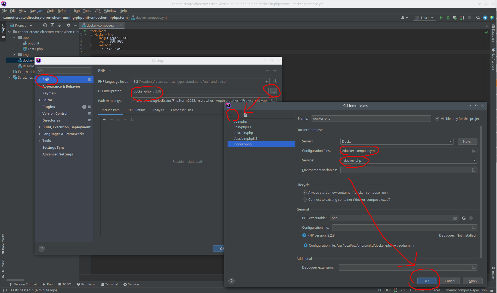
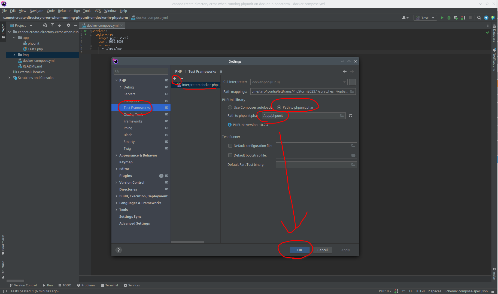
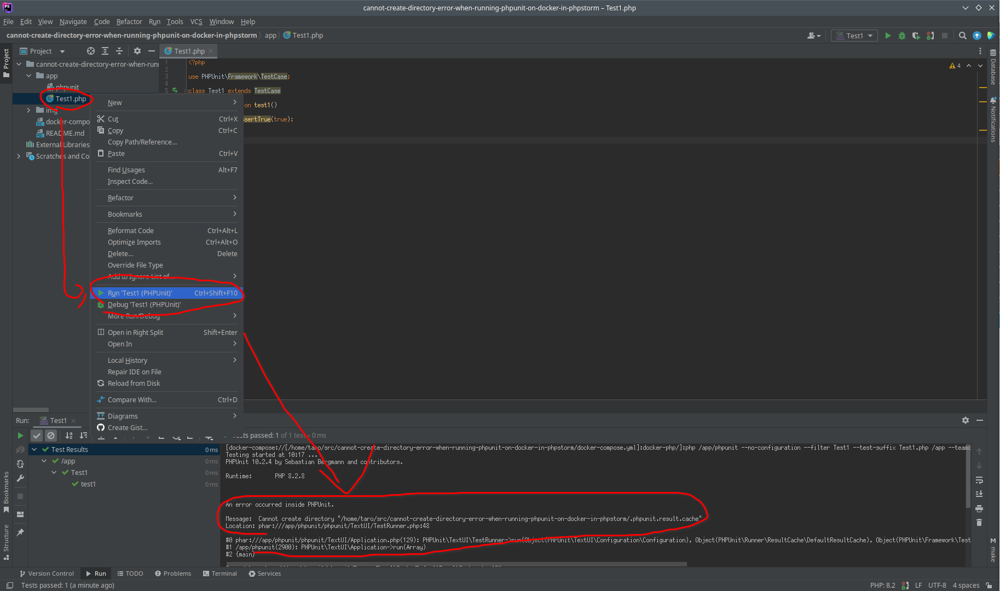

# Cannot create directory error when running phpunit on docker in phpstorm


## Result

Cannot create directory error:

```
[docker-compose://[/home/taro/src/cannot-create-directory-error-when-running-phpunit-on-docker-in-phpstorm/docker-compose.yml]:docker-php/]:php /app/phpunit --no-configuration --filter Test1 --test-suffix Test1.php /app --teamcity --cache-result-file=/home/taro/src/cannot-create-directory-error-when-running-phpunit-on-docker-in-phpstorm/.phpunit.result.cache
Testing started at 0:15 ...
PHPUnit 10.2.4 by Sebastian Bergmann and contributors.

Runtime:       PHP 8.2.8


An error occurred inside PHPUnit.

Message:  Cannot create directory "/home/taro/src/cannot-create-directory-error-when-running-phpunit-on-docker-in-phpstorm/.phpunit.result.cache"
Location: phar:///app/phpunit/phpunit/TextUI/TestRunner.php:48

#0 phar:///app/phpunit/phpunit/TextUI/Application.php(129): PHPUnit\TextUI\TestRunner->run(Object(PHPUnit\TextUI\Configuration\Configuration), Object(PHPUnit\Runner\ResultCache\DefaultResultCache), Object(PHPUnit\Framework\TestSuite))
#1 /app/phpunit(2900): PHPUnit\TextUI\Application->run(Array)
#2 {main}

Caused by: phar:///app/phpunit/phpunit/Runner/ResultCache/DefaultResultCache.php:106

#0 phar:///app/phpunit/phpunit/Runner/ResultCache/ResultCacheHandler.php(54): PHPUnit\Runner\ResultCache\DefaultResultCache->persist()
#1 phar:///app/phpunit/phpunit/Runner/ResultCache/Subscriber/TestSuiteFinishedSubscriber.php(23): PHPUnit\Runner\ResultCache\ResultCacheHandler->testSuiteFinished()
#2 phar:///app/phpunit/phpunit/Event/Dispatcher/DirectDispatcher.php(90): PHPUnit\Runner\ResultCache\TestSuiteFinishedSubscriber->notify(Object(PHPUnit\Event\TestSuite\Finished))
#3 phar:///app/phpunit/phpunit/Event/Dispatcher/DeferringDispatcher.php(48): PHPUnit\Event\DirectDispatcher->dispatch(Object(PHPUnit\Event\TestSuite\Finished))
#4 phar:///app/phpunit/phpunit/Event/Emitter/DispatchingEmitter.php(589): PHPUnit\Event\DeferringDispatcher->dispatch(Object(PHPUnit\Event\TestSuite\Finished))
#5 phar:///app/phpunit/phpunit/Framework/TestSuite.php(269): PHPUnit\Event\DispatchingEmitter->testSuiteFinished(Object(PHPUnit\Event\TestSuite\TestSuiteWithName))
#6 phar:///app/phpunit/phpunit/TextUI/TestRunner.php(44): PHPUnit\Framework\TestSuite->run()
#7 phar:///app/phpunit/phpunit/TextUI/Application.php(129): PHPUnit\TextUI\TestRunner->run(Object(PHPUnit\TextUI\Configuration\Configuration), Object(PHPUnit\Runner\ResultCache\DefaultResultCache), Object(PHPUnit\Framework\TestSuite))
#8 /app/phpunit(2900): PHPUnit\TextUI\Application->run(Array)
#9 {main}

Process finished with exit code 255
```

/home/taro/src/cannot-create-directory-error-when-running-phpunit-on-docker-in-phpstorm/ is the path in the docker host.
It is not in the docker container.


## Expected result

No Cannot create directory error.


## Environment

```
PhpStorm 2023.1.3
Build #PS-231.9161.47, built on June 22, 2023
Runtime version: 17.0.7+10-b829.16 amd64
VM: OpenJDK 64-Bit Server VM by JetBrains s.r.o.
Linux 5.15.0-76-generic
GC: G1 Young Generation, G1 Old Generation
Memory: 962M
Cores: 8
Registry:
    run.processes.with.pty=TRUE


Current Desktop: KDE
```


## Steps to reproduce

1. Configure php interpreter:  


2. Configure phpunit:


3. Right click on app/Test1.php and click "Run 'Test1 (PHPUnit)'":  

